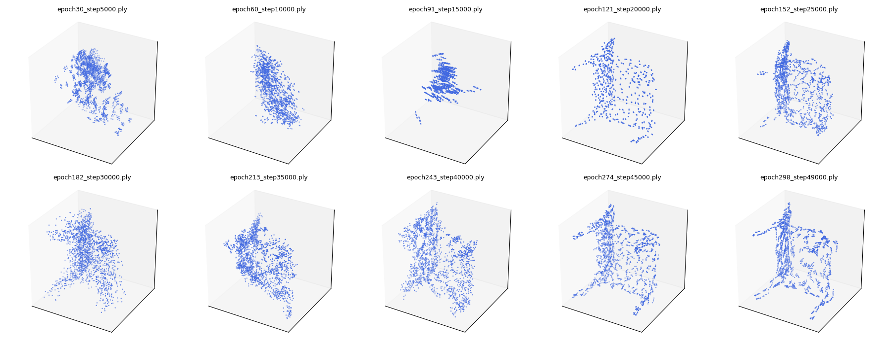

# Generative 3DWheatNet (BI-Net)

> **Note**: This project is a **work in progress**.

This repository provides an educational implementation of **BI-Net**, inspired by the paper:  
[**3D Point Cloud Shape Generation with Collaborative Learning of Generative Adversarial Network and Auto-Encoder**](https://www.mdpi.com/2072-4292/16/10/1772)

**BI-Net** merges an **autoencoder** (AE) and a **GAN** into a single framework to generate 3D point clouds. The network includes:
- An **encoder-decoder** for reconstruction (using EMD/Chamfer loss).
- A **discriminator** to improve realism of synthetic shapes.
- A **uniformity loss** (NNME) that encourages evenly distributed points.
---

## Overview

**BI-Net** aims to generate high-quality 3D point clouds while preserving fine structural details. The model has two main components:

- **Autoencoder**:  
  \- Encodes an input point cloud to a latent code and reconstructs it, typically measured via EMD or Chamfer.  
- **GAN**:  
  \- A generator produces synthetic point clouds from random latent vectors, while the discriminator distinguishes between real and generated clouds. We employ **gradient penalty** for stable training.  
  \- An additional **NNME** loss helps ensure uniform point coverage.  

Optionally, **warm-up epochs** let the AE converge somewhat before enabling adversarial steps.

---

## Features

- **Combined AE + GAN** for 3D generation
- **Gradient Penalty (WGAN-GP)** for better training stability
- **NNME Loss** to encourage uniform point distribution
- **Warm-up** support to train AE first (if configured)
- **Open3D** used for point cloud visualization and `.ply` export
- **TensorBoard** logging (AE_loss, D_loss, G_loss, etc.)

---

## Installation

1. **Clone this repository**:
   ```bash
   git clone https://github.com/joehrz/Generative_3DWheatNet.git
   cd Generative_3DWheatNet

2. **Build Instructions**:
   ```bash
   pip install -r requirements.txt
   ```

## Dataset

We utilize the ShapeNet dataset, a large-scale repository of 3D shapes spanning numerous object categories. This dataset is described in:

> **Citation**:  
> Chang, Angel X., et al.,
> "ShapeNet: An Information-Rich 3D Model Repository.",  
> arXiv:1512.03012 [cs.GR], Stanford University --- Princeton University --- Toyota Technological Institute at Chicago, 2015.

## Wheat Dataset
The wheat data is not publicly available at this time. We plan to share more information in the future.

**Data Preparation**

Place raw .ply (or other 3D formats supported by Open3D) point-cloud files in `data/raw/`.  
The folder `data/processed/` (or `data/preprocessed`) will store generated .npz files after running preprocessing steps.

## Usage

**Data Preprocessing**

To downsample, unify point counts, and normalize:
```bash
python main.py --preprocess \
    --input_dir data/raw \
    --output_dir data/processed \
    --voxel_size 0.02 \
    --num_points 2048 \
    --use_fps
```

**Training**

Once you have preprocessed .npz files in `data/processed`, you can train BI-Net:
```bash
python main.py --train \
    --data_dir data/processed \
    --batch_size 8 \
    --epochs 10 \
    --device cuda
```
Adjust parameters (batch size, epochs, GPU device, etc.) as needed. You can also specify other flags like learning rates or latent dimensions if supported in `main.py`.

**Evaluation**
```bash
python scripts/evaluate.py \
    --model_checkpoint bi_net_checkpoint.pth \
    --batch_size 16 \
    --latent_dim 128 \
    --data_root data/processed \
    --split test
```

**Intermediate Results**

Below are some **non-final** yet promising outcomes demonstrating the model’s steady improvement:

1. **Shapenet Chairs Epoch Progression**  
   

The above illustrates generated chair point clouds evolving over training, gradually improving structure and uniformity.

```bash
python scripts/evaluate.py \
    --model_checkpoint bi_net_checkpoint.pth \
    --batch_size 16 \
    --latent_dim 128 \
    --data_root data/processed \
    --split test
```

## Things to Do Next
- **Model Improvement**  
  Investigate and address the reasons for sub-par model performance. Consider hyperparameter tuning, architecture adjustments, or additional training data.
- **Add Data Augmentations**  
  Implement rotations, flips, or random noise injections specifically tailored to wheat data, improving model robustness.
- **Tune TreeGCN Structure**  
  Experiment with different degrees, deeper or shallower expansions, or alternate activation functions.
- **Refine NNME Loss**  
  Investigate advanced metrics for point uniformity or coverage. Try weighting schemes or multi-scale nearest neighbors.
- **Integrate Additional Losses**  
  Explore other 3D losses (e.g., EMD loss) if relevant.
- **Benchmark on Baseline Datasets**  
  Validate on other point-cloud datasets (e.g., ShapeNet or agricultural data) to confirm generalization.
- **Improve Logging/Visualization**  
  Enhance real-time monitoring, add 3D shape visualizations, or integrate with TensorBoard to compare models.# Updated Thu Jul 10 07:45:14 CDT 2025
